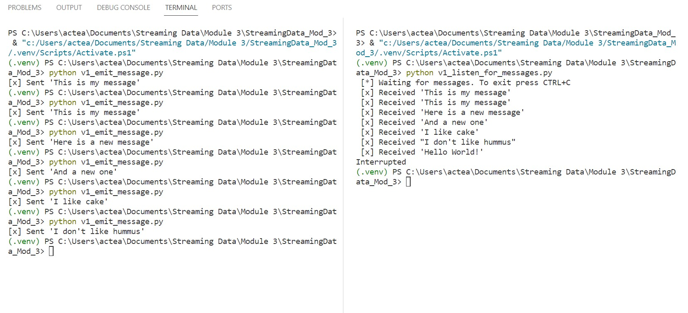
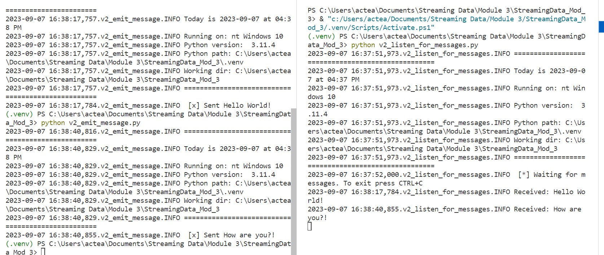

# streaming-03-rabbitmq

## Before You Begin

1. Fork this starter repo into your GitHub account.
1. Clone your repo down to your machine.
1. Explore your new project repo in VS Code on your local machine.

## Initial Tasks

1. Create a new virtual environment:
```
python -m venv .venv
```

1. Activate that virtual environment:
`.venv\Scripts\activate`

1. Make sure you have all pip requirements:
`python -m pip install -r requirements.txt`

1. Verify your set up with the fllowing commands. (This is just meant to be helpful. My aboutrabbit didn't work, but all the coding did. That was because my RabbitMQ was configured in a different location)

```shell
python util_about.py
python util_aboutenv.py
python util_aboutrabbit.py
pip list
```


1. Read the [RabbitMQ Hello World! tutorial](https://www.rabbitmq.com/tutorials/tutorial-one-python.html)
1. Read the code and comments in our 2 project files: emit_message.py and listen_for_messages.py

## Version 1

1. Read v1_emit_message.py (and the tutorial)
1. Run the file. 
1. Read v1_listen_for_messages.py (and the tutorial)
1. Run the file.
    You'll need to fix an error in the program to get it to run.
    Once it runs successfully, will it terminate on its own? How do you know? 
        A: It does not appear to terminate on its own. I know this to be true because the code requires the use of pressing CTRL+C to stop the program.
    As long as the process is running, we cannot use this terminal for other commands. 
1. Open a new terminal window and run emit_message.py again.
        Q: Watch the listing terminal - what do you see?  A second message?
            A: Every time I run emit_message.py, I see a new message emerge on the other powershell. 

1. Change the message and re-run the program. Do this at least 4 different times.
    Q: Where is the message defined? How can you change it?
        A:The message is defined in line 19 of the program. It is in the "body" of the channel. You also had to change the message that was printed at the end.
1. Watch what happens in the listening terminal.




## Version 1 DRY

Did you notice you had to change the message in TWO places?

1. You update the actual message sent. 
1. You also update what is displayed to the user. 
1. Fix this by introducing a variable to hold the message. 
1. Use your variable when sending. 
1. Use the variable again when displaying to the user. 

Now, to send a new message, you'll only make ONE change.
Updating and improving code is called 'refactoring'. 
Use your skills to keep coding enjoyable. 

## Version 2

Now look at the second version of each file.
These include more graceful error handling,
and a consistent, reusable approach to building code.

Each of the version 2 programs include an error as well. 

1. Find the error and fix it. 
    In the emit message file, I had to make sure the blocking connection pulled in the value for host. I also had to adjust the spelling errors in local host.
    In the listen for messages file, I again had to make sure the blocking connection pulled in the correct value. I also had to add the actual name "local host" in the final function.
1. Compare the structure of the version 2 files. 
    The version 2 files are a bit more complex and provide more insight into what system and python version are being used to send and receive the messages. 
1. Modify the docstrings on all your files.
1. Include your name and the date.
1. Imports always go at the top, just after the file docstring.
1. Imports should be one per line - why?
1. Then, define your functions.
1. Functions are reusable logic blocks.
1. Everything the function needs comes in through the arguments.
1. A function may - or may not - return a value. 
1. When we open a connection, we should close the connection. 
1. Which of the 4 files will always close() the connection?
    The emit messages file with always close the connection. The listen for messages file requires ctrl+C to close the connection.
1. Search GitHub for if __name__ == "__main__":
1. How many hits did you get? 
    I got 4.3 million hits when I searched for this. 
1. Learn and understand this common Python idiom.
    After a brief google search, I see that this python idioma is best used to control which code is being executed when there are difference scenarios.



## Reference

- [RabbitMQ Tutorial - Hello, World!](https://www.rabbitmq.com/tutorials/tutorial-one-python.html)
- [Using Python environments in VS Code](https://code.visualstudio.com/docs/python/environments)
- [RabbitMQ Get Started](https://www.rabbitmq.com/#getstarted)

